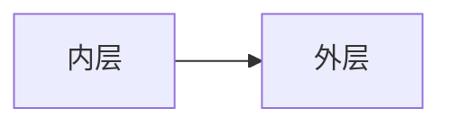
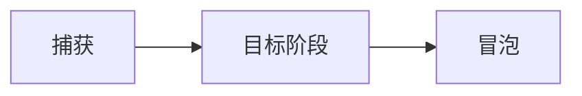
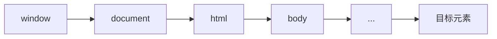
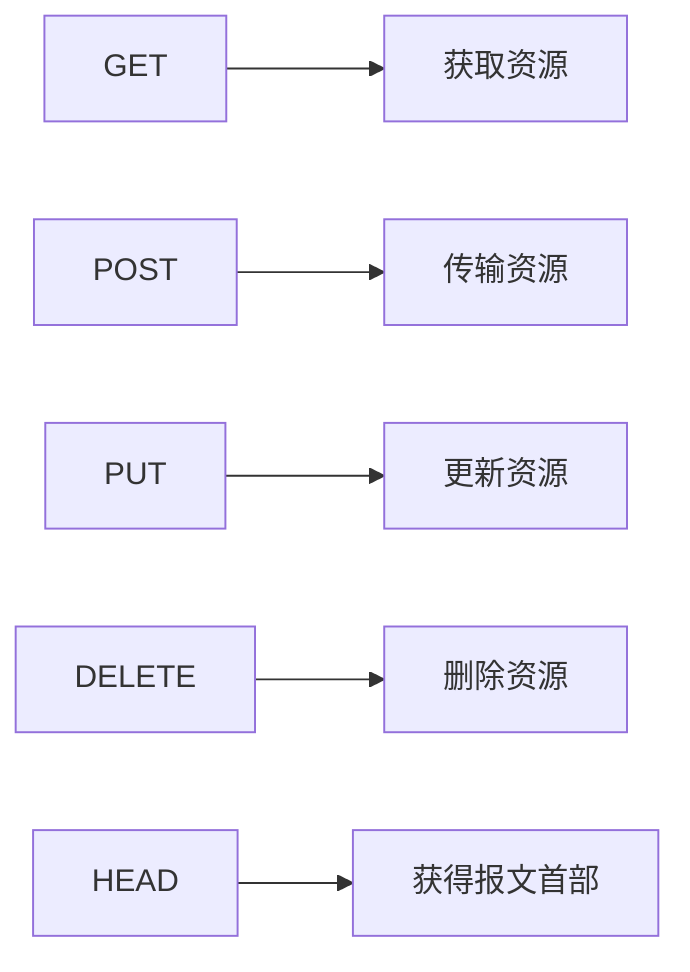
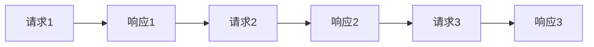
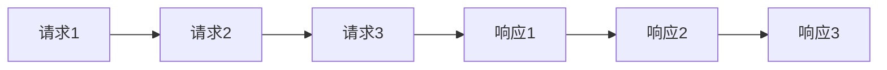

### 页面布局

#### 例如：

##### 题目：假设宽度已知，请写出三栏布局，其中左栏、右栏宽度各为300px，中间自适应。

###### 答：（目前已知）有6种解决方案：分别是 float布局、absolute布局、flex布局、table布局、grid布局、inline-block布局。

---

##### 追问：他们的优缺点各是什么？

##### 答：

###### float布局：

优点：兼容性好（低版本浏览器基本都支持）<br>
缺点：脱离文档流，需要清除浮动

###### absolute布局：

优点：使用起来比较方便、快捷<br>
缺点：后面的子元素也会脱离文档流，可用性较差。

###### flex布局：

优点：基本比较完美<br>
缺点：老版本浏览器可能不兼容。

###### table布局：

优点：兼容性好<br>
缺点：如果一个元素文本高度超出撑大容器，旁边元素的也会一起增加。

###### table布局：

优点：代码简洁<br>
缺点：一般浏览器还不支持。

###### inline-block布局：

优点：不用脱离文档流<br>
缺点：元素之间会因为标签代码间的换行符产生间隙。<br>
解决方案：1、父容器 font-size: 0px;<br>
&emsp;&emsp;&emsp;&emsp;&emsp;2、子容器恢复、或者设置letter-spacing: -5px;(具体数值跟字体和浏览器有关)
---

### CSS盒模型

#### 标准模型和ie模型的区别？

###### 标准模型：宽高计算只计算content；

###### ie模型：宽高计算包括content、padding、border；

#### CSS如何设置这俩种模型？

###### 标准模型：box-sizing: content-box;

###### ie模型：box-sizing: border-box;

#### JS如何获得设置盒模型的宽和高？

1. dom.style.width/height (只能取到内联的样式)
2. dom.currentStyle.width/height (可以取到页面渲染之后的实际宽和高；缺点：只有ie才支持)
3. window.getComputedStyle(dom).width/height (兼容firefox、chrome 浏览器的方法)
4. dom.getBoundingClientRect().width/height (计算元素的绝对位置（元素距离视窗左边、上边的位置）、以及元素的实际宽高)

#### 实例题（根据盒模型解释边距重叠）？

###### 边界重叠是指两个或多个盒子(可能相邻也可能嵌套)的相邻边界(其间没有任何非空内容、补白、边框)重合在一起而形成一个单一边界。

#### BFC（边距重叠解决方案）的基本概念：块级格式化上下文

#### BFC的原理/规则：

1. Box垂直方向的距离由margin决定，属于同一个BFC的两个相邻BOX的margin会发生重叠。
2. BFC的区域不会与浮动元素的Box重叠。
3. BFC在页面上是一个独立的容器，外面的元素不会影响里面的元素，反过来里面也不会影响外面。
4. 计算BFC高度的时候，浮动元素也会参与计算。

#### 如何去创建一个BFC？

1. float的值不为none
2. position的值不为static或者relative
3. display属性设置为inline-block、table-cell、 table-caption、flex、inline-flex。
4. overflow不为visiable

#### BFC的使用场景？

1. 清除内部浮动。
2. 控制垂直margin合并与否。
3. 创建自适应两栏布局（例如去除图文环绕）。

#### 基本概念：DOM事件的级别？

1. DOM0：element.onclik = function() {}
2. DOM2: element.addEventListener("click", function() {}, false);
3. DOM3: element.addEventListener("keyup", function() {}, false);

#### 事件模型？

捕获

```
graph LR
外层-->内层
```

冒泡



#### 事件流？



#### 描述DOM事件的具体流程？



#### Event对象的常见应用？

```js
event.preventDefault(); // 阻止默认事件执行
event.stopPropagation(); // 阻止事件冒泡
event.stopImmediatePropagation(); // 阻止后续的事件执行（事件优先级）
event.currentTarget; // 绑定事件的元素
event.target; // 实际点击的元素
```

#### 自定义事件？

```js
var eve = new Event('custom'); // 创建一个事件
ev.addEventListener('custom', function() {}, false); // dom元素绑定监听事件
ev.dispatchEvent(eve); // 触发该事件
```

###### Tips: ==CustomEvent== (可以增加一个指定的参数)

---

### http协议类

#### HTTP协议的主要特点？

1. 简单快速：每个资源的URI是固定的（统一资源符）
2. 灵活：每一个HTTP都有一个头部分，通过HTTP请求就可以完成不同数据类型的传输。
3. ==无连接==：链接一次就会断开。
4. ==无状态==：单从HTTP无法确定访问者的身份。

#### HTTP报文的组成部分？

##### 请求报文：

1. 请求行：HTTP方法、页面地址、HTTP协议以及版本
2. 请求头：key：val 值
3. 空行：间隔
4. 请求体：具体数据部分

##### 响应报文：

1. 状态行：HTTP协议以及版本 状态码
2. 响应头：key：val 值
3. 空行：间隔
4. 响应体：返回的数据部分

#### HTTP方法：



### HTTP协议类 POST和GET的区别？

1. ==GET在浏览器回退时是无害的，而POST会再次提交请求==
2. GET产生的URL地址可以被收藏，而POST不可以。
3. ==GET请求会被浏览器主动缓存，而POST不会，除非手动设置==
4. GET请求只能进行URL编码，而POST支持多种编码方式
5. ==GET请求参数会被完整保留在浏览器记录里，而POST中的参数不会被保留==
6. ==GET请求在URL中传递的参数是有长度限制的，而POST没有限制==
7. 对参数的数据类型，GET只接受ASCII字符，而POST没有限制
8. GET比POST更不安全，因为参数直接暴露在URL上，所以不能用来传递敏感信息
9. ==GET参数通过URL传递，POST放在Request body==

### HTTP协议类 HTTP状态码？

- 1xx：指示信息-表示请求已接收，继续处理
- 2xx：成功-表示请求已成功接收
- 3xx：重定向-要完成请求必须进行更近一步的操作
- 4xx：客户端错误-请求有语法错误或请求无法实现
- 5xx：服务端错误-服务器未能实现合法的请求

### HTTP协议类 具体的HTTP状态码？

- 200 ok：客户端请求成功
- 206 Partial Content：客户发送了一个带有Range头的GET请求，服务器完成了它
- 301 Moved Permanently: 所请求的页面已经转移至新的URL
- 302 Found:  所请求的页面已经临时转移至新的URL
- 304 Not Modified：客户端有缓冲的文档并发出了一个条件性的请求，服务端告诉客户端，原来缓冲的文档还可以继续使用
- 400 Bad Request：客户端请求有语法错误，不能被服务器所理解
- 401 Unauthorized：请求未经授权，这个状态码必须和WWW-Authenticate报头域一起使用
- 403 Forbidden：对被请求页面的访问被禁止
- 404 Not Found：请求资源不存在
- 500 Internal Server Error：服务器发生不可预期的错误原来缓冲的文档还可以继续使用
- 503 Server Unavailable：请求未完成，服务器临时过载或宕机，一段时间后可能恢复正常

### HTTP协议类 持久连接和非持久连接的区别？
###### HTTP协议采用“请求-应答”模式，当使用普通模式（即非 Keep-Alive 模式时），每个请求/应答客户和服务器都要建立一个连接，完成之后立即断开链接（HTTP为无连接的协议）

###### 当使用Keep-Alive模式（又称持久连接、连接重用）时，Keep-Alive功能使客户端到服务端的连接持续有效，当出现对服务器的后记请求时，keep-Alive功能避免了建立或者重新建立连接

### HTTP协议类 管线化？
##### 在使用持久连接的情况下，某个连接上消息的传递类似于：


##### 在使用管线化的情况下，某个连接上消息的传递变成：


### HTTP协议类 管线化的特点？
1. ==管线化机制通过持久连接完成，仅HTTP/1.1支持此技术==
2. ==只有GET和HEAD请求可以进行管线化，而Post则有所限制==
3. ==初次创建连接时不应启动管线机制，因为对方（服务器）不一定支持HTTP/1.1版本的协议==
4. 管线化不会影响响应到来的顺序，如上面的例子所示，响应返回的顺序并未改变
5. HTTP/1.1要求服务器支持管线化，但并不要求服务端你也对响应进行管线化处理，只是要求对于管线化的请求不失败即可
6. 由于上面提到的服务器端问题，开启管线化很可能不会带来大幅度的性能提升，而且很多服务器和代理程序对管线化的支持并不好，因此现代浏览器如Chrome和Firefox默认并未开启管线化支持
#### 通信类
##### 什么是同源策略及限制？
2. Cookie、localStorage 和indexDB无法读取；
3. DOM无法获得
4. AJAX请求不能发送
##### 前后端如何通讯?
1. Ajax
2. WebSocket
3. CORS
##### 如何创建Ajax?
1. XMLHttpRequest对象的工作流程
2. 兼容性处理
3. 事件的触发条件 (xhr.onload)
4. 事件的触发顺序 xhr.status
##### 跨域通信的几种方式?
1. Jsonp
2. Hash
3. postMessage
4. WebSocket
5. CORS
